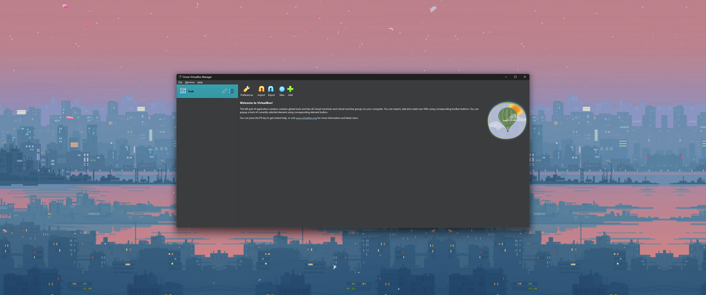
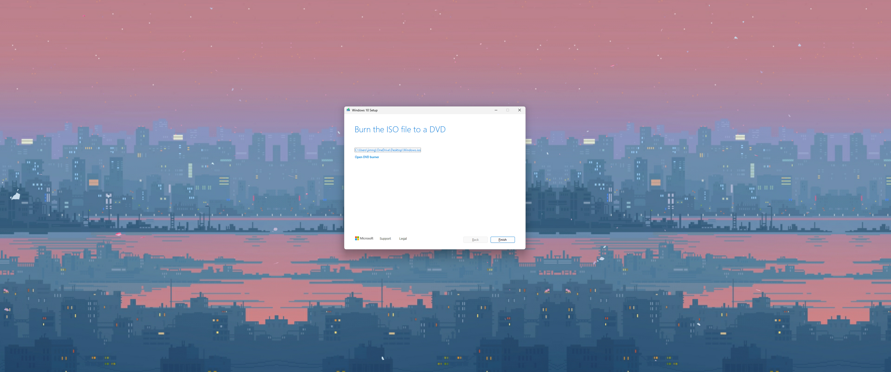
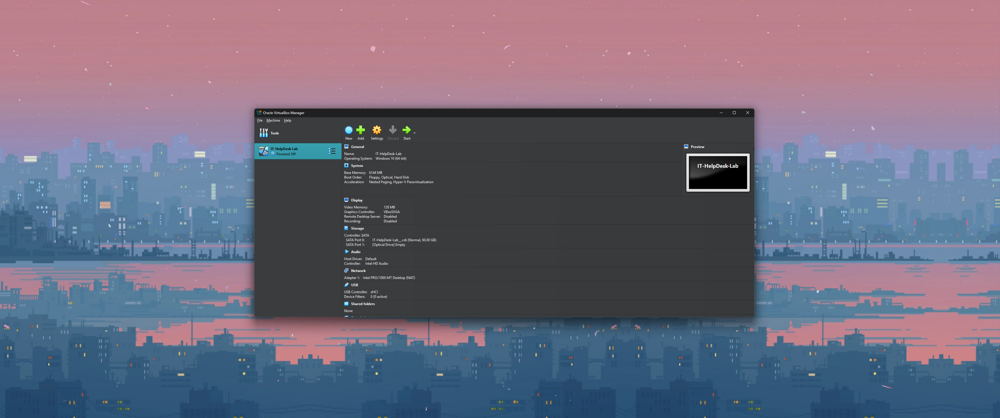
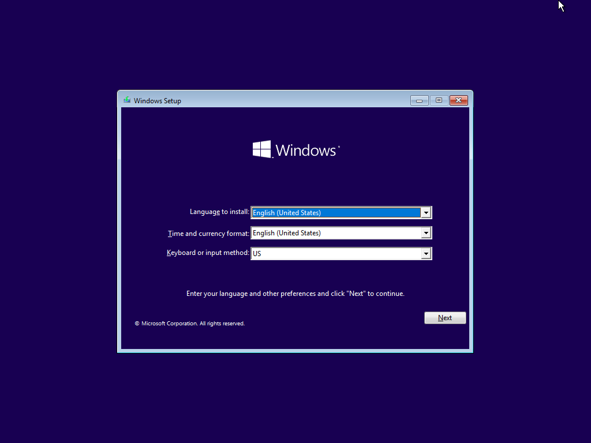
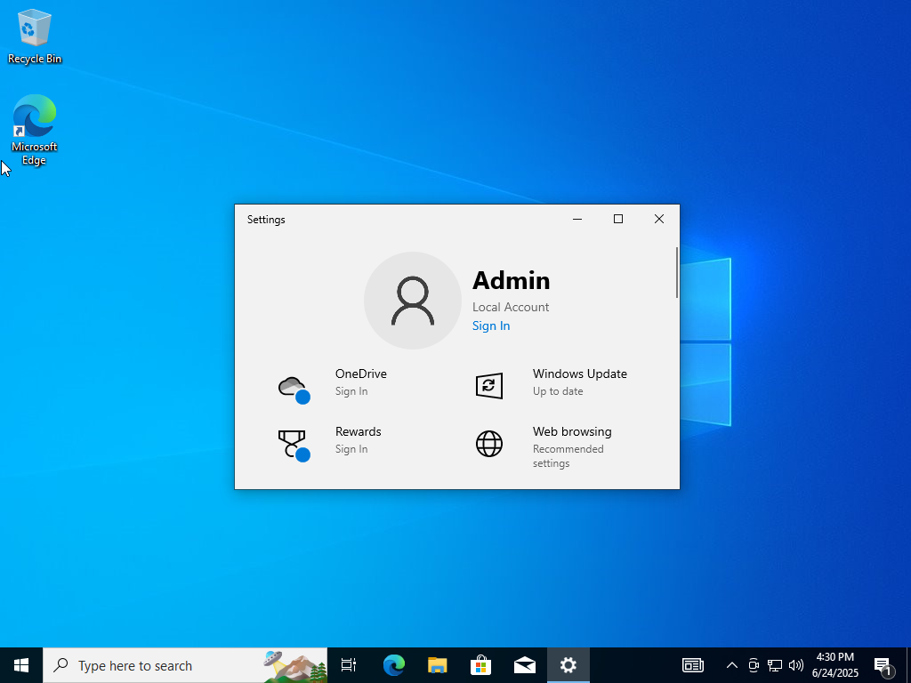
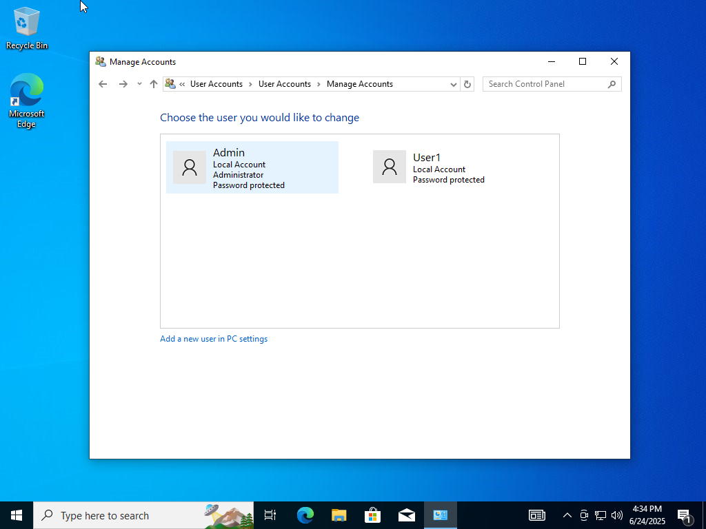
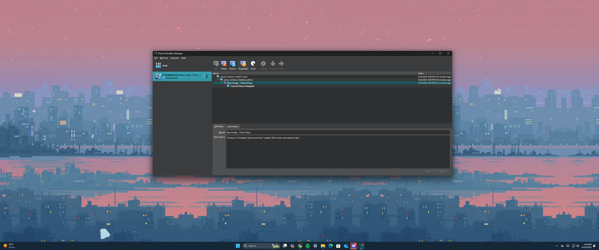
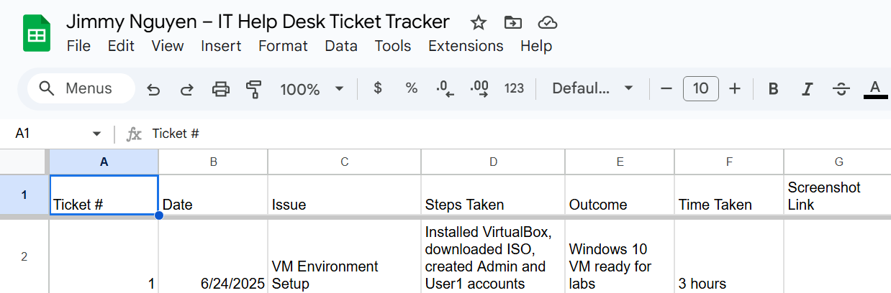

# Lab 00 – VM Setup and Configuration

**Date:** June 24, 2025  
**Ticket #:** 001  
**Issue:** Setup of Windows 10 virtual environment for IT help desk labs  
**Resolution:** Installed Windows 10 VM, created Admin and User1 accounts, and took a clean snapshot

---

## Steps Taken

1. Installed VirtualBox and downloaded Windows 10 ISO  
2. Created virtual machine and installed Windows  
3. Created Admin account and local user `User1`  
4. Verified both accounts worked  
5. Took snapshot titled `Base Image – Clean Setup1`
6. Structured folders for future lab documentation  
7. Created IT Help Desk ticket tracker in Google Sheets

---

## Screenshot(s)

  
  
  
  
  
  
  
  

