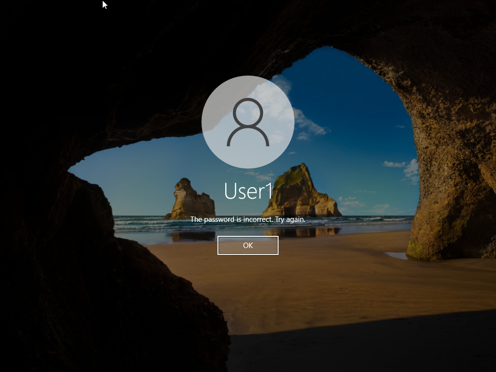
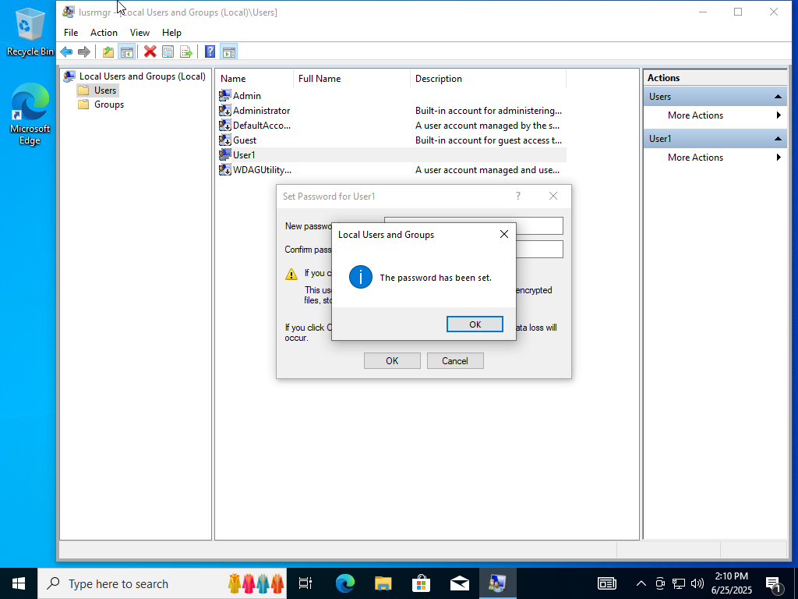
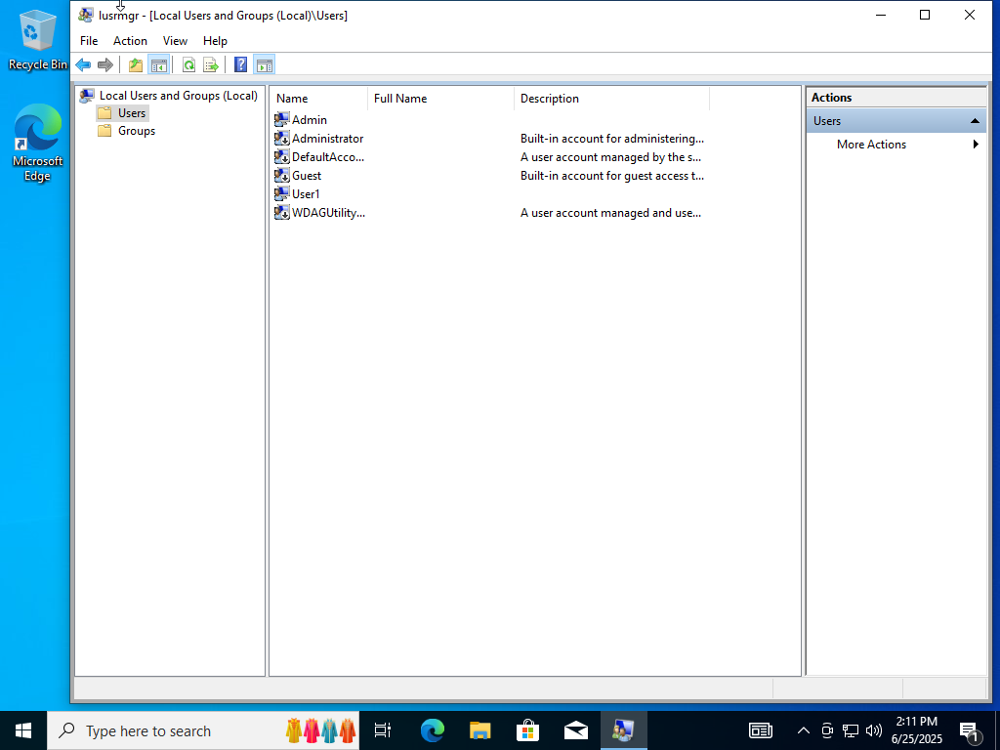
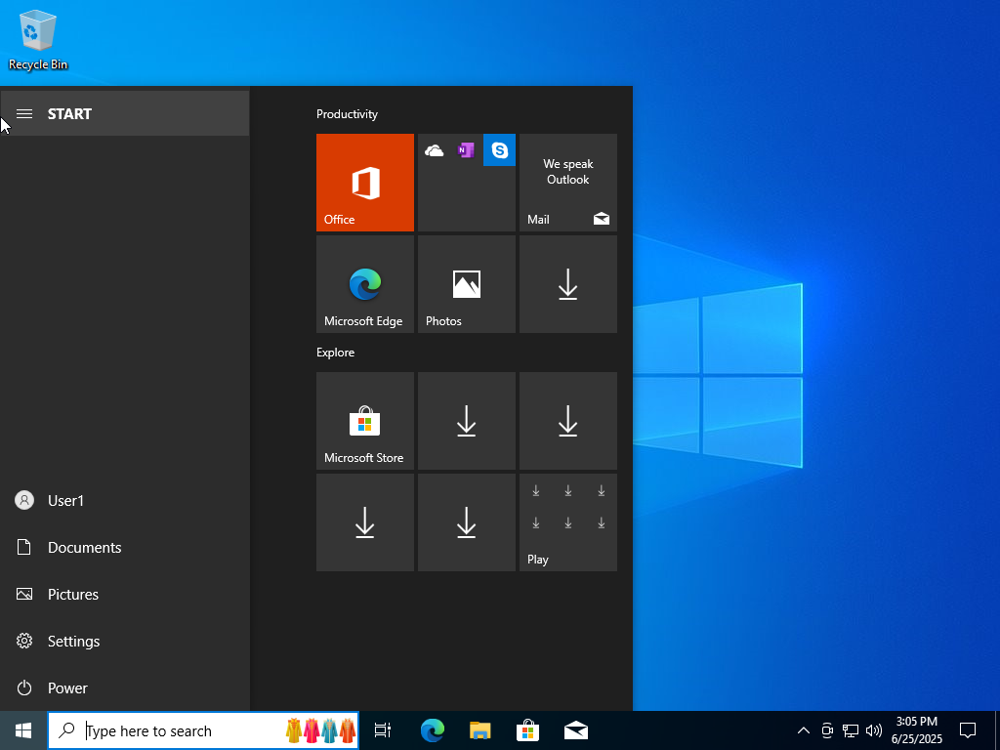
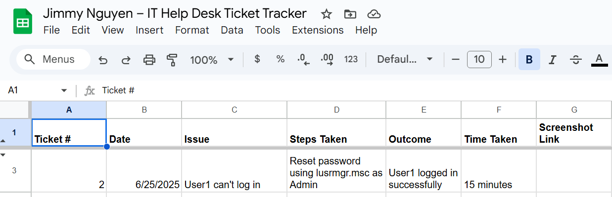

# Lab 01 – Password Reset

**Date:** June 25, 2025  
**Ticket #:** 002  
**Issue:** `User1` unable to log in due to incorrect password  
**Resolution:** Reset password via Local Users and Groups (`lusrmgr.msc`) as Admin. User successfully logged in.

---

## Steps Taken

1. Attempted login as `User1` – failed multiple times  
2. Logged in as `Admin`  
3. Opened `lusrmgr.msc`  
4. Reset password for `User1` to `ResetUser123!`  
5. Tested login as `User1` – confirmed success

---

## Screenshot(s)

  
  
  
  

