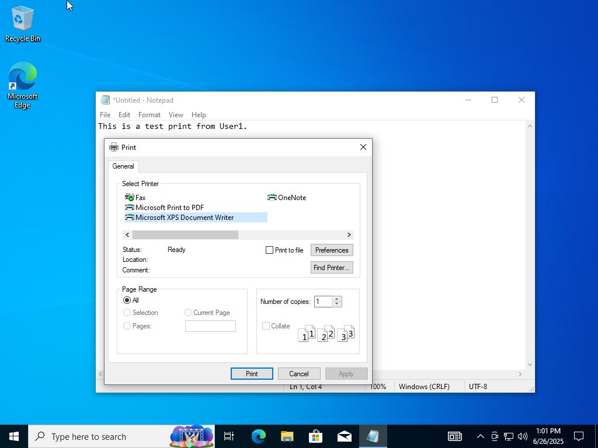
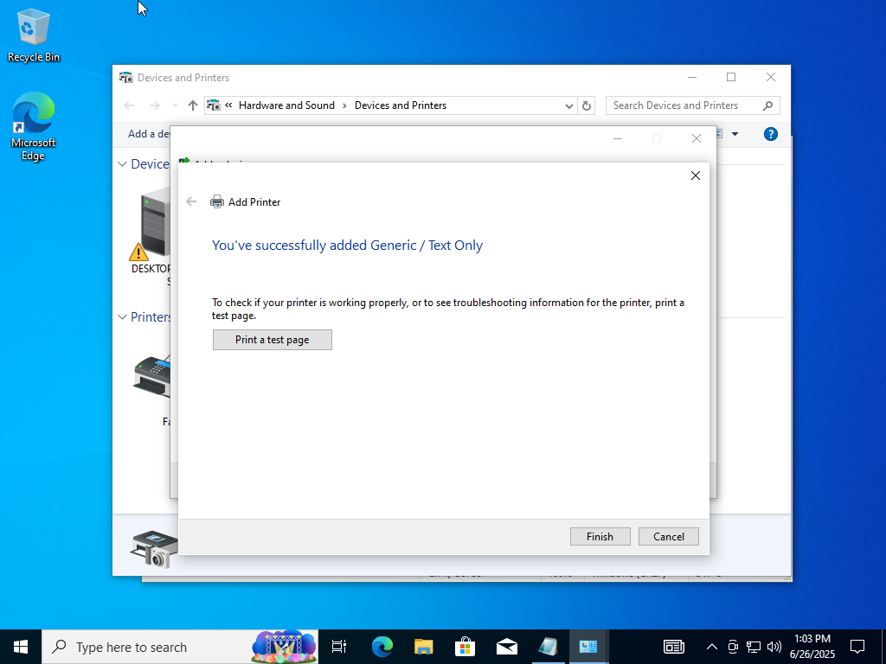
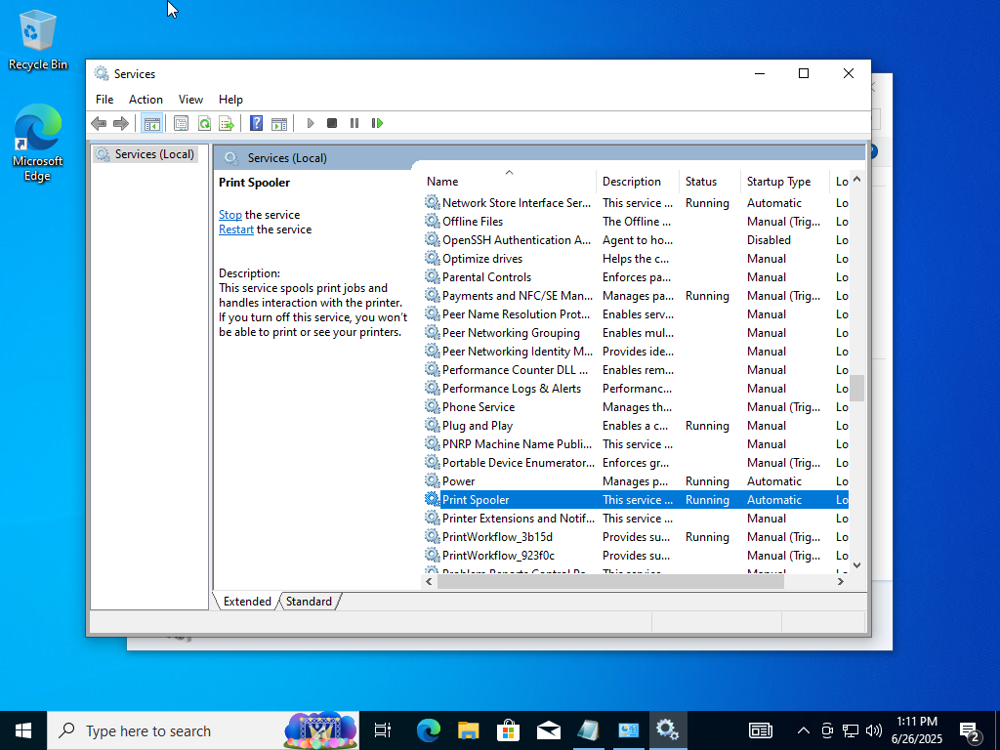
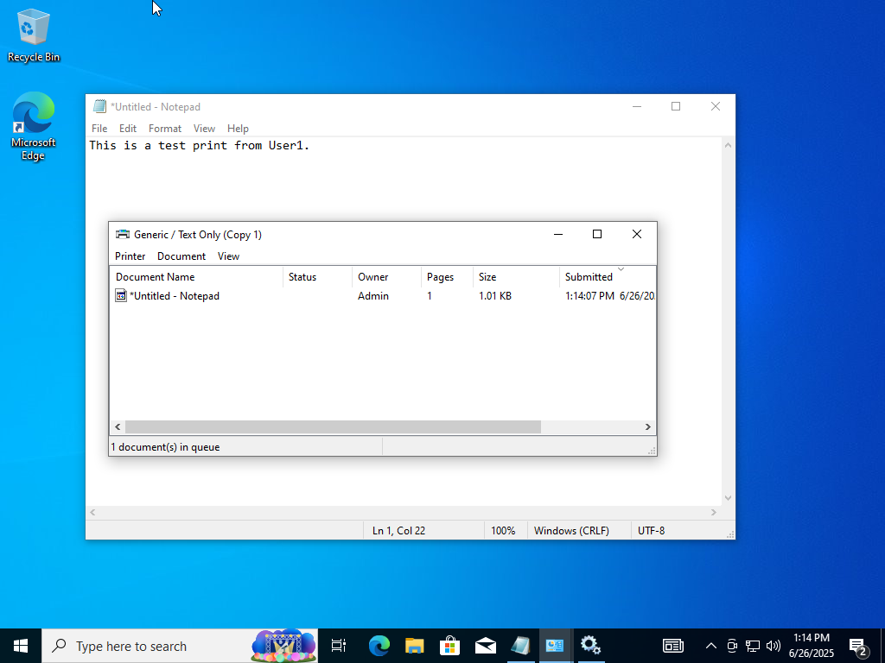
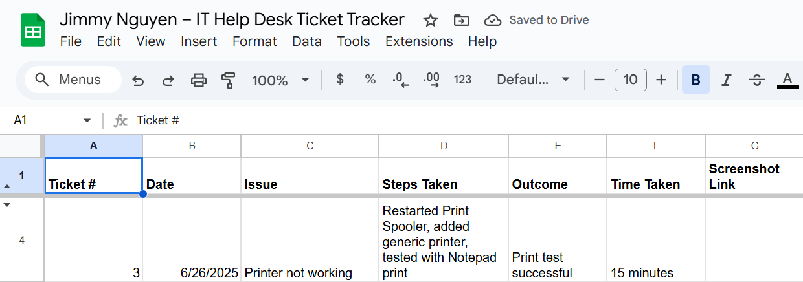

# Lab 02 – Printer Not Working

**Date:** June 26, 2025  
**Ticket #:** 003  
**Issue:** User cannot print to the default printer  
**Resolution:** Restarted Print Spooler service and re-added a generic local printer. Print test successful.

---

## Steps Taken

1. Logged in as User1 and attempted to print — failed  
2. Checked printer status in `control printers`  
3. Re-added a dummy printer using Generic/Text Only driver  
4. Restarted `Print Spooler` via `services.msc`  
5. Retested print job — simulated success  
6. Logged resolution in ticket tracker

---

## Screenshot(s)

  
  
  
  

