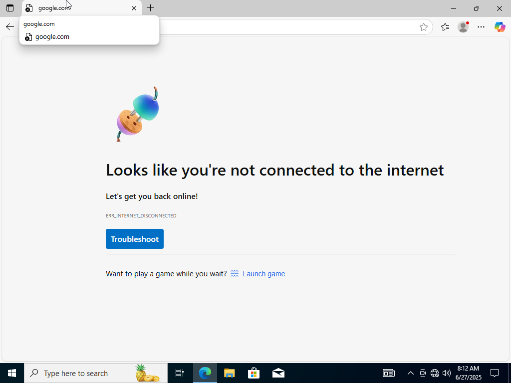
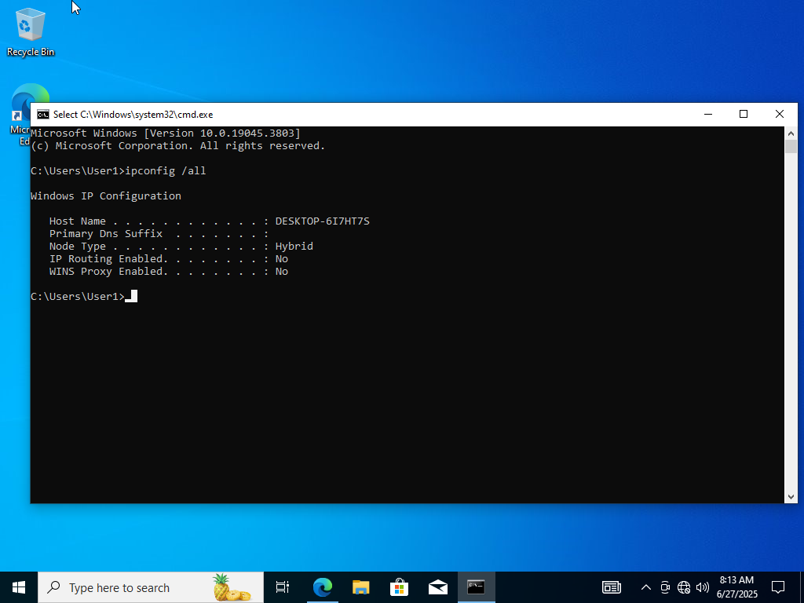
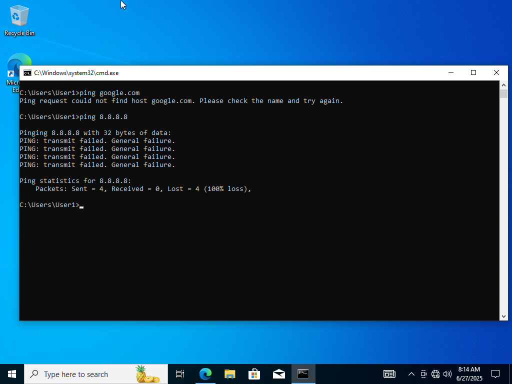
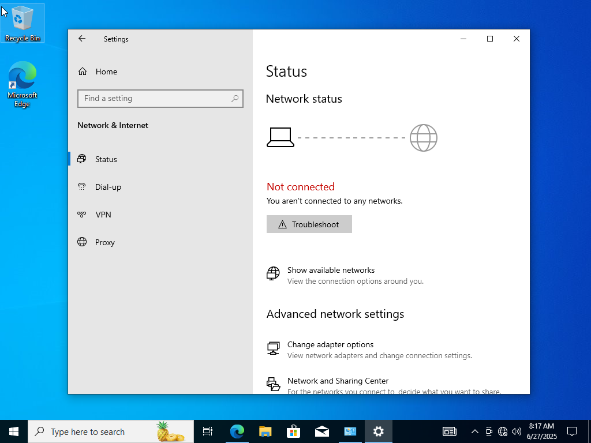
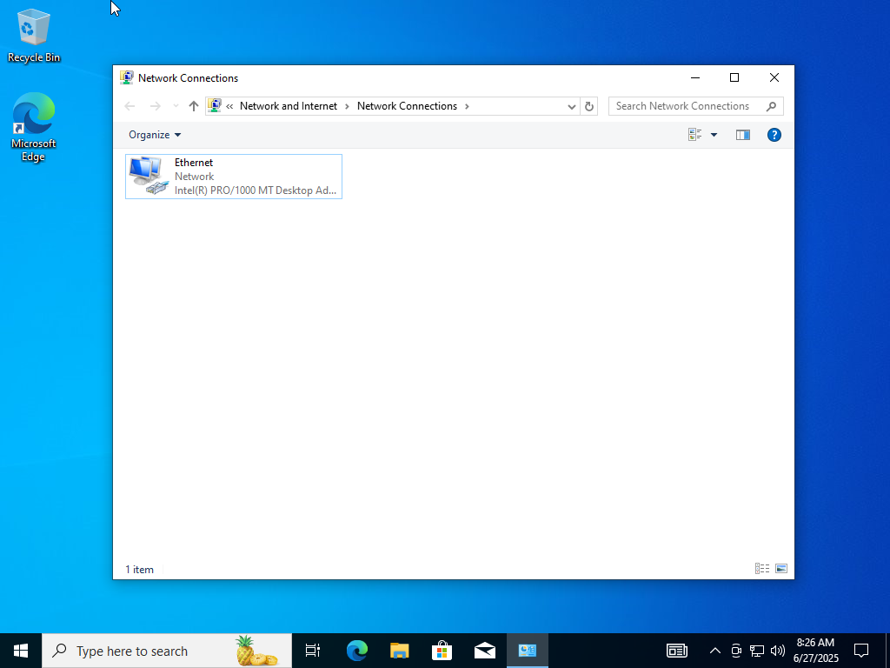
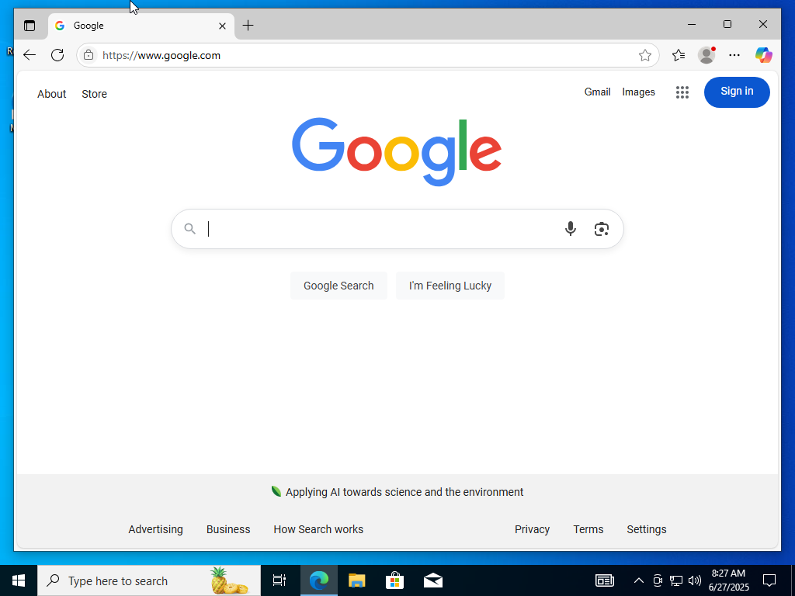
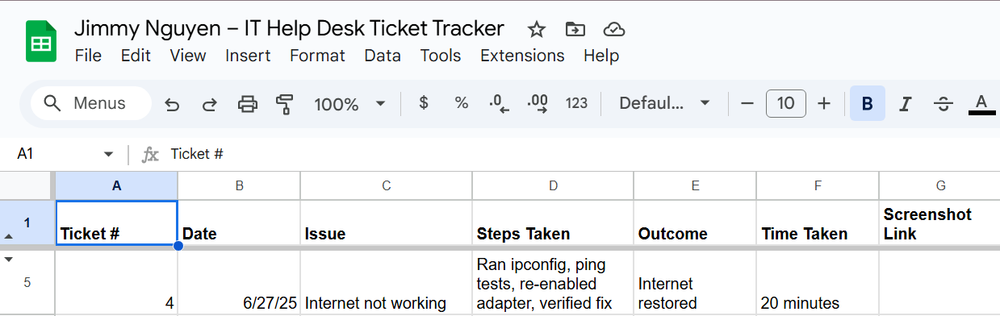

# Lab 03 – Internet Not Working

**Date:** June 27, 2025  
**Ticket #:** 004  
**Issue:** User1 reports no internet access  
**Resolution:** Ran ipconfig, confirmed no IP assigned, re-enabled network adapter. Verified internet restored.

---

## Steps Taken

1. Opened browser — confirmed no internet access  
2. Ran `ipconfig /all` in Command Prompt  
3. Performed `ping google.com` and `ping 8.8.8.8`  
4. Checked adapter settings via `ncpa.cpl`  
5. Re-enabled adapter and verified automatic IP settings  
6. Confirmed fix via browser and ping  
7. Logged resolution in ticket tracker

---

## Screenshot(s)

  
  
  
  
  
  

