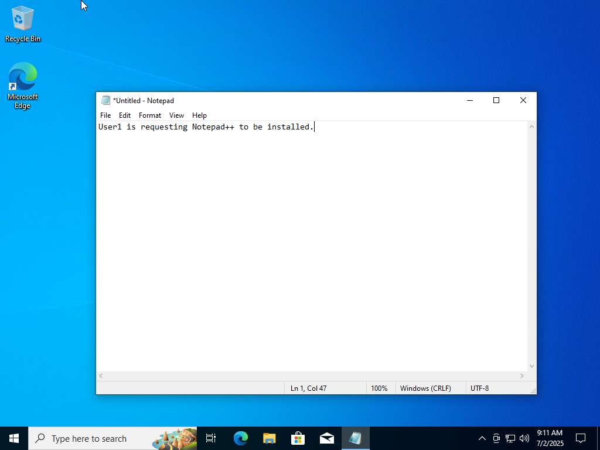
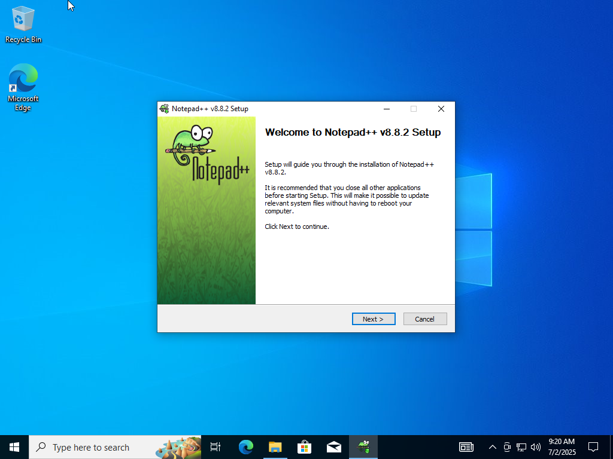
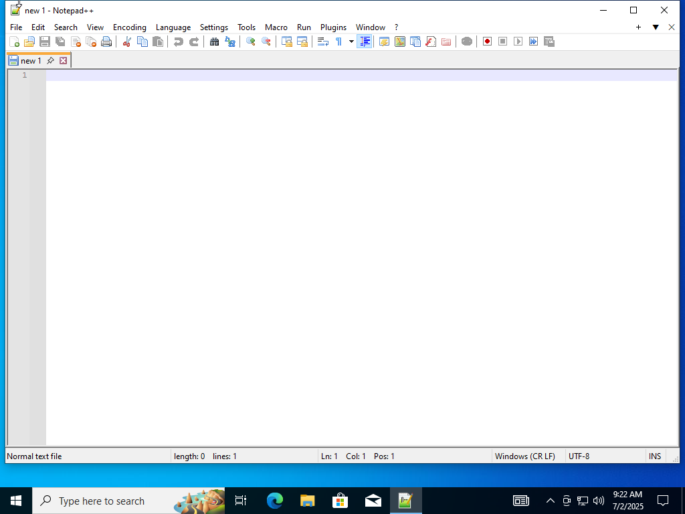
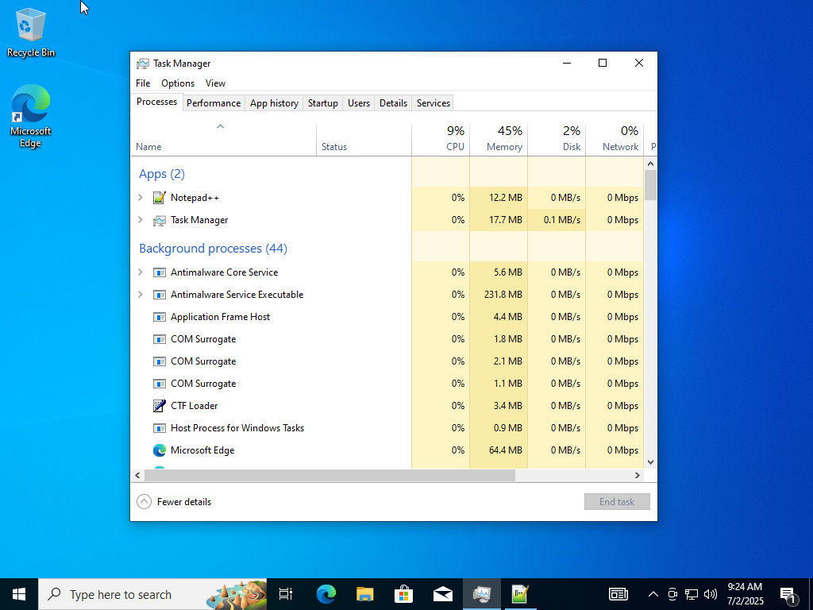
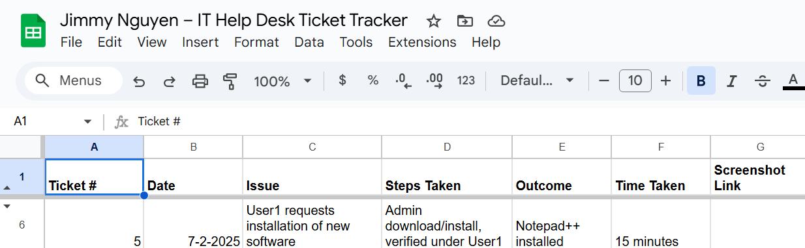

# Lab 04 – Software Installation

**Date:** July 2, 2025  
**Ticket #:** 005  
**Issue:** User1 requested installation of Notepad++
**Resolution:** Switched to Admin, installed Notepad++, verified access for User1.

---

## Steps Taken

1. Logged in as User1 and documented the request  
2. Switched to Administrator  
3. Downloaded and installed Notepad++  
4. Switched back to User1 and verified it launched  
5. (Optional) Confirmed via Task Manager  
6. Logged resolution in ticket tracker

---

## Screenshot(s)

  
  
  
  

