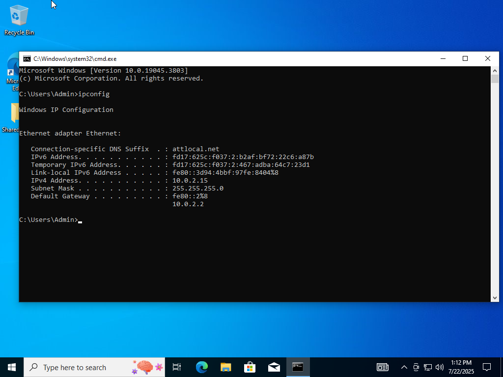
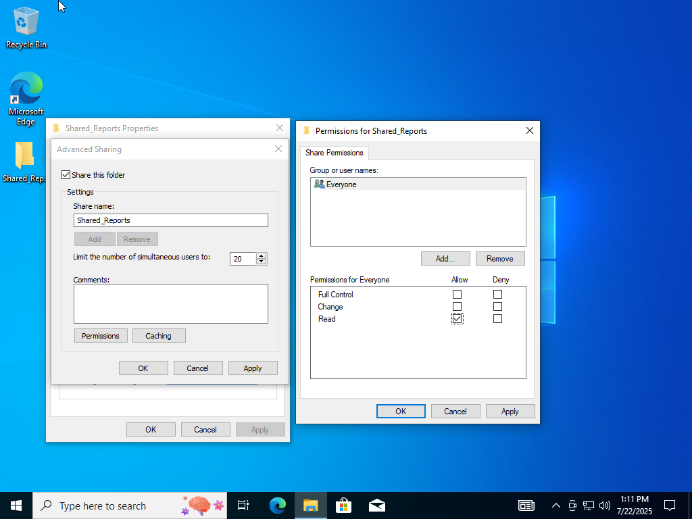
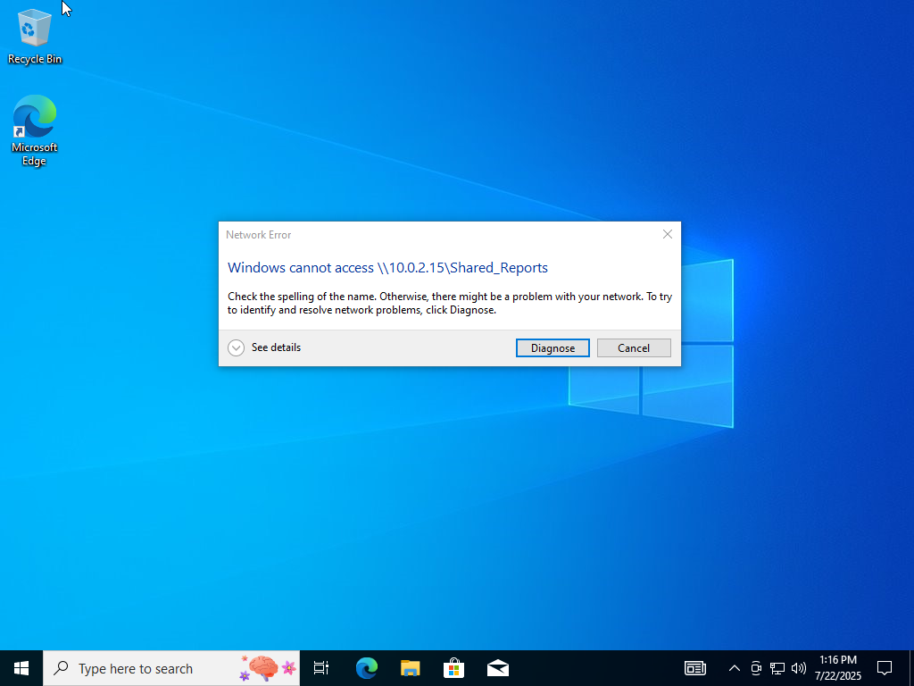
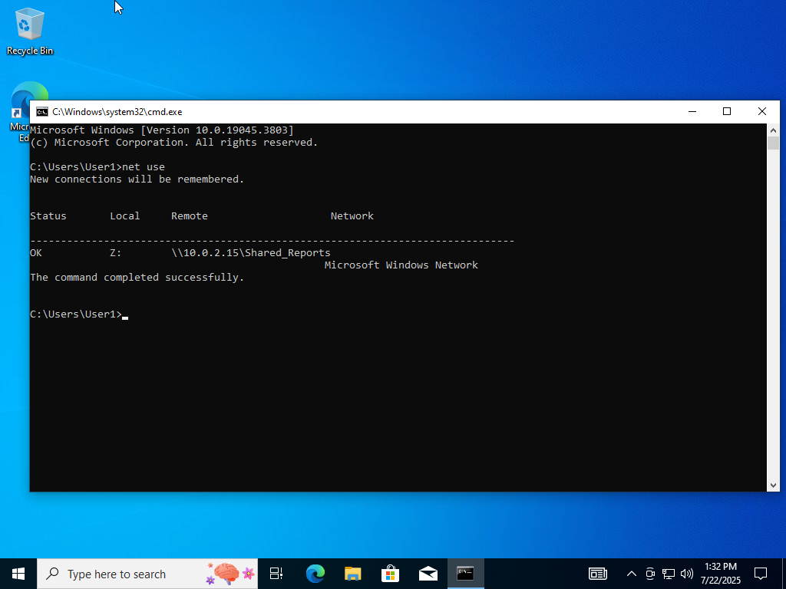
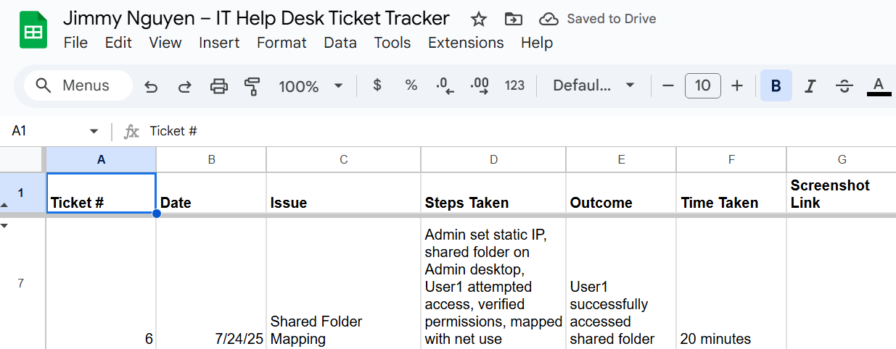

# Lab 05 – Shared Folder Mapping

**Date:** July 24, 2025  
**Ticket #:** 006  
**Issue:** User1 cannot access a shared folder from Admin’s machine  
**Resolution:** Configured shared folder permissions and mapped network drive using `net use`. User1 successfully accessed the share.

---

## Steps Taken

1. Logged in as Admin and configured a static IP using `ipconfig` 
2. Created a folder on Admin’s desktop → enabled sharing and set permissions  
3. Logged in as User1 → attempted to access the shared folder via `\\Admin_IP\lab_share` → access denied  
4. Logged back in as Admin → verified permissions and shared path  
5. Mapped drive manually using `net use Z: \\Admin_IP\lab_share`  
6. Access confirmed; folder now visible in File Explorer  
7. Logged resolution in ticket tracker

---

## Screenshot(s)

  
  
  
  

